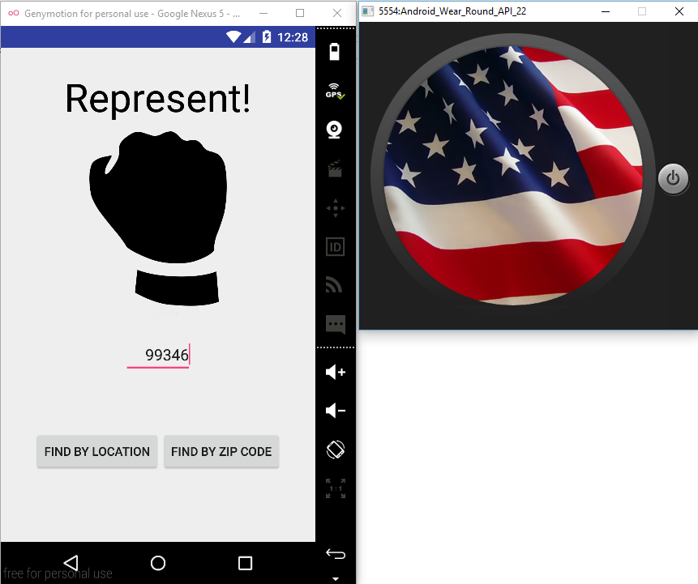
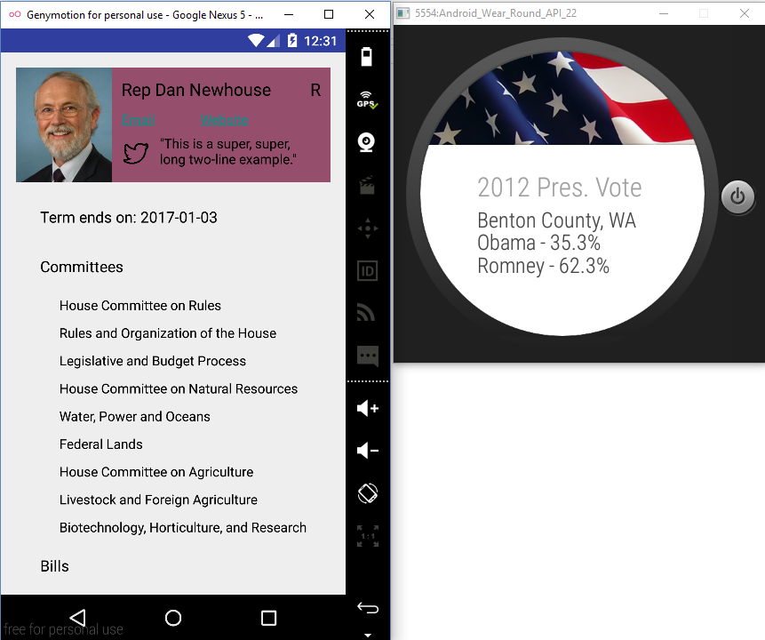
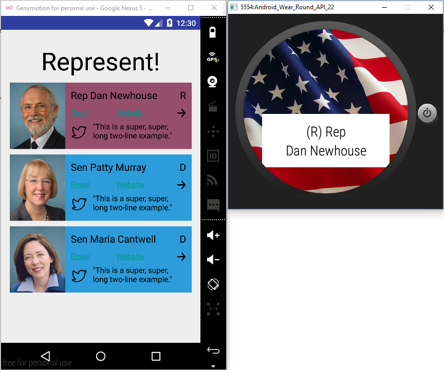
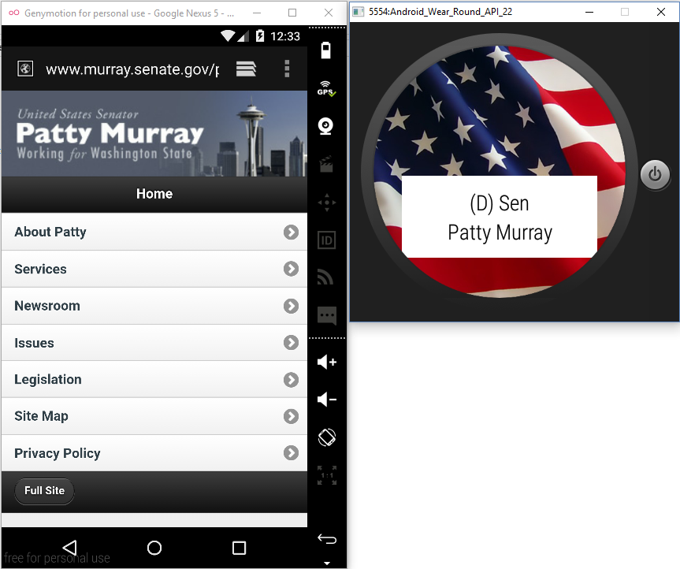

# PROG 02: Represent!

My Represent app takes the current location or an entered zip code and finds the Senators & Representatives for that place. It displays them on the phone, and the names come up on the watch as well. More information, including committees and bills sponsored, can be displayed about each person on the phone as well. The watch also has an extra view that displays the results of the 2012 Presidential election for the country the current location or zip code is in.

## Authors

Eric Bo ([ericbo@berkeley.edu](mailto:ericbo@berkeley.edu))

## Demo Video

See Prog2C (https://youtu.be/HPhoCjNG8sE)

## Screenshots

## Acknowledgments

* ActionFragment Credits: http://stackoverflow.com/questions/24969086/is-there-an-easy-way-to-create-an-action-button-fragment
* Invalid & valid zips JSON: https://gist.github.com/dryan/7486408
* Picutres: http://square.github.io/picasso/
* Google's Location & Maps API (for getting current location & reverse geocoding)
* Sunlight Foundation API for all congressional info: http://tryit.sunlightfoundation.com/congress
* 2012 vote data given in json by staff
* Help from friends
* Skeleton code by staff
